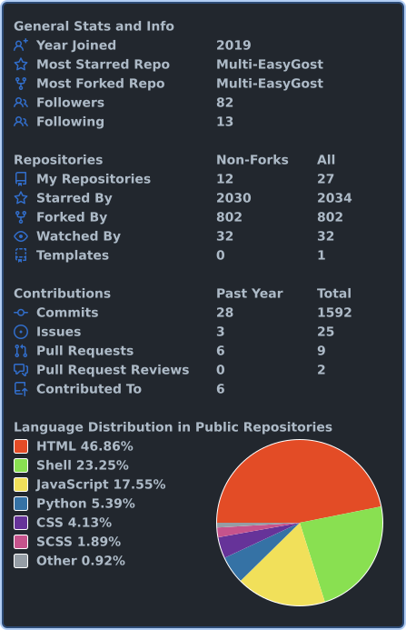
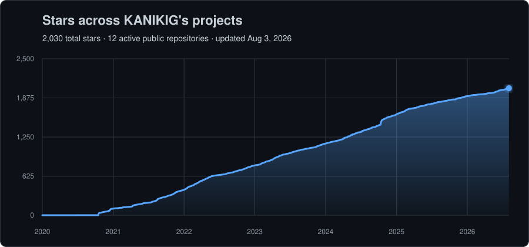

# Hi, I'm KANIKIG 👋

Engineering researcher who codes for fun and contributes fixes back to the open-source tools I use.

## Open-source contributions

<table>
  <tr>
    <td width="50%" valign="top">
      <h3><a href="https://github.com/verl-project/verl/pull/7199">verl-project/verl · #7199</a></h3>
      
Preserved generation configuration while merging Megatron checkpoints.

      
      
    </td>
    <td width="50%" valign="top">
      <h3><a href="https://github.com/hiyouga/EasyR1/pull/11007">hiyouga/EasyR1 · #11007</a></h3>
      
Preserved generation configuration during checkpoint model merges.

      
      
    </td>
  </tr>
</table>

## Featured projects

<table>
  <tr>
    <td width="50%" valign="top">
      <h3><a href="https://github.com/KANIKIG/Multi-EasyGost">Multi-EasyGost</a></h3>
      
A beginner-friendly, multi-platform management script for GOST.

      
      
      
    </td>
    <td width="50%" valign="top">
      <h3><a href="https://github.com/KANIKIG/wechat-search-weread">wechat-search-weread</a></h3>
      
A skill for searching WeChat Official Account articles.

      
      
      
    </td>
  </tr>
</table>

## GitHub at a glance

## Stars across my projects

The badge is the live account total; the chart is rebuilt weekly across my accessible public, non-fork repositories.

